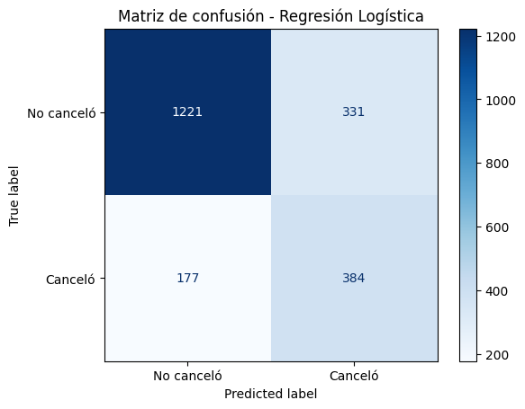
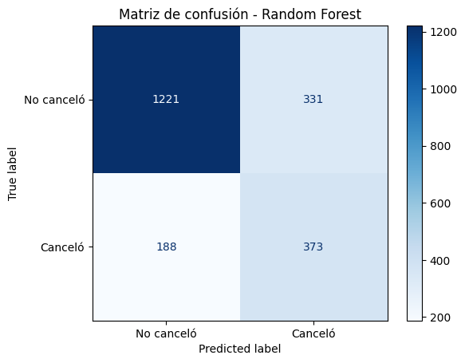
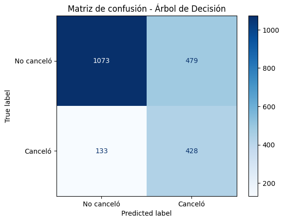

# 📊 Análisis de Cancelación de Clientes - Telecom X parte 2

## 📌 Objetivo
Este proyecto busca **predecir la cancelación de clientes** en una empresa de telecomunicaciones y entender los factores que más influyen en esta decisión.  
El análisis se realizó con diferentes modelos de Machine Learning y se complementó con un estudio exploratorio de las variables.

---

## 🛠️ Metodología
1. **Limpieza de datos**  
   - Eliminación de identificadores únicos (ej. `id`).  
   - Codificación de variables categóricas (`One-Hot Encoding`).  
   - Balanceo de clases en el set de entrenamiento con **SMOTE**.  

2. **Análisis Exploratorio (EDA)**  
   - Proporción de cancelación (≈26%).  
   - Matriz de correlación para identificar variables más influyentes.  
   - Análisis dirigido:  
     - **Tiempo de contrato vs Cancelación** → contratos cortos, más riesgo.  
     - **Pagos mensuales vs Cancelación** → facturas altas, más riesgo.  

3. **Modelado**  
   - **Baseline (DummyClassifier)**: referencia (predice siempre la clase mayoritaria).  
   - **Regresión Logística (con normalización)**.  
   - **Árbol de Decisión (profundidad limitada)**.  
   - **Random Forest (tuning de hiperparámetros)**.  
   - Modelos adicionales: **KNN, SVM y XGBoost**.  

4. **Evaluación**  
   - Métricas: **Accuracy, Precisión, Recall, F1, ROC-AUC**.  
   - Visualización: **Matriz de confusión** y **Curvas ROC**.  

---

## 📈 Resultados de modelos

| Modelo              | Accuracy | Precisión | Recall  | F1-score | AUC   |
|---------------------|----------|-----------|---------|----------|-------|
| Baseline            | 0.7345  | 0.0000    | 0.0000  | 0.0000   | 0.50  |
| Regresión Logística | 0.7596  | 0.5371    | 0.6845  | 0.6019   | **0.820** |
| Random Forest       | 0.7544  | 0.5298    | 0.6649  | 0.5897   | 0.819 |
| Árbol de Decisión   | 0.7104  | 0.4719    | **0.7629** | 0.5831 | 0.811 |

📌 **Modelo recomendado**: **Regresión Logística**, ya que alcanzó el mejor **AUC** y un F1 competitivo frente a Random Forest.  
El **Random Forest** sigue siendo una opción robusta, y con ajuste aún más fino de hiperparámetros podría mejorar. 

   
   
   
---

## 🔎 Factores más influyentes en la cancelación
1. **Tiempo de contrato**: contratos cortos = mayor riesgo de cancelación.  
2. **Tipo de contrato**: mes a mes = mayor churn, contratos largos = más estabilidad.  
3. **Pagos mensuales**: facturas altas correlacionan con mayor cancelación.  
4. **Servicio de internet (fibra óptica)**: usuarios con fibra muestran más probabilidad de baja.  
5. **Método de pago (electronic check)**: clientes con este método tienen más rotación.  

---

## 📉 Curvas ROC
- La **curva ROC** permite evaluar la capacidad de discriminación de cada modelo.  
- El **área bajo la curva (AUC)** indica la habilidad de separar clientes que cancelan de los que permanecen:  
  - **Baseline** ≈ 0.50 (equivalente al azar).  
  - **Regresión Logística** y **Random Forest** con las mejores curvas, separándose claramente de la diagonal.
  - **Árbol de Decisión** menos estable, pero con buen recall.
    
    
    .png)
     
   
---

## 💬 Comentarios sobre modelos adicionales
- **KNN**: sensible al número de vecinos, menor estabilidad y rendimiento.  
- **SVM**: buen desempeño, pero costo computacional elevado y baja interpretabilidad.  
- **XGBoost**: competitivo y consistente con las variables clave; con tuning adecuado podría superar a RF.  

---

## 💡 Estrategias de retención
- **Antigüedad baja + Factura alta** → planes ajustados, bundles con descuento y beneficios iniciales.  
- **Clientes con contrato mes a mes** → incentivos para migrar a planes largos (mes gratis, upgrade de velocidad).  
- **Clientes con fibra óptica** → soporte proactivo y bonificaciones por interrupciones.  
- **Pagadores con electronic check** → fomentar migración a débito automático o tarjeta.  
- **Onboarding de 0–90 días** → contacto proactivo y campañas personalizadas.  

---

## ⚠️ Limitaciones y trabajo futuro
- Dataset con desbalance moderado → explorar técnicas de **ensembles balanceados**.  
- No se incluyeron variables externas (competencia, promociones, satisfacción cliente).  
- Futuro: probar **XGBoost con hyperparameter tuning** y modelos de **aprendizaje profundo**.  

---

## 📌 Conclusión
- La cancelación de clientes está fuertemente ligada a **contratos cortos, facturas altas y métodos de pago menos estables**.  
- **Regresión Logística** fue el modelo con mejor rendimiento global (**AUC=0.820**).  
- **Random Forest** se mantiene competitivo y útil para relaciones no lineales.  
- **Árbol de Decisión** es simple e interpretable, pero menos estable.  
- Modelos adicionales confirmaron la robustez de los hallazgos.  

---

## 📂 Estructura del proyecto
- `notebooks/` → análisis exploratorio y modelado.  
- `data/` → dataset original y versiones procesadas.  
- `models/` → modelos entrenados.  
- `README.md` → resumen de hallazgos y conclusiones (este documento).  

---

## ✍️ Autor
**Pablo Santander**  
📅 *19 de agosto de 2025*
